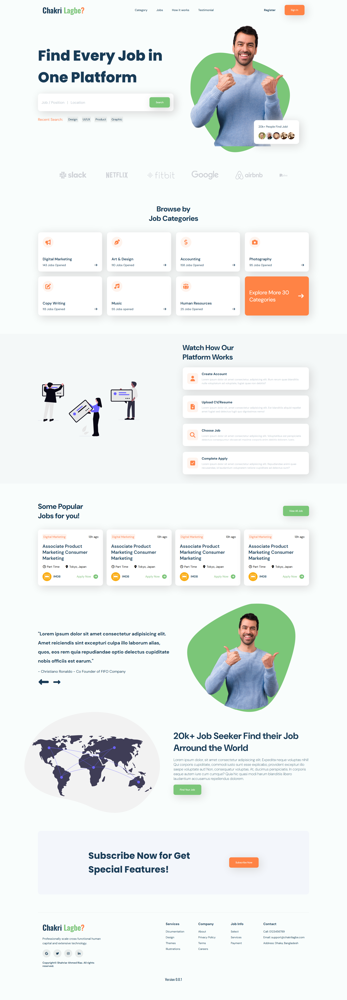

# 💼 Chakri Lagbe? — Job Finding Landing Page

<div align="center">

  <h3>🚀 A modern and responsive job-finding platform landing page</h3>

  <p>
    A clean, professional and user-friendly landing page designed for a modern job search platform.
  </p>

  <p>
    <a href="https://ahmed-shahriar04.github.io/chakri_lagbe-landing-page/">🌐 Live Demo</a>
    &nbsp; • &nbsp;
    <a href="https://github.com/ahmed-shahriar04/chakri_lagbe-landing-page">📂 GitHub Repository</a>
  </p>

</div>

---

## 📌 Project Overview

**Chakri Lagbe?** is a modern job-finding platform landing page designed to provide job seekers with a simple and engaging way to explore job opportunities.

The project focuses on creating a clean and visually appealing user interface with responsive layouts, job categories, popular job listings, platform workflow, testimonials, subscription section, and contact information.

This project was built as a front-end web development practice project to strengthen my skills in **HTML, CSS, responsive design, layout systems, and UI implementation**.

---

## 📸 Project Screenshot

<div align="center">
  
</div>

---

## ✨ Main Features

- 🎯 Modern and clean landing page design
- 📱 Responsive layout for different screen sizes
- 🔍 Job search section with position and location fields
- 🏷️ Browse jobs by different categories
- 💼 Popular job listing section
- 👤 Job seeker workflow section
- 📄 CV/Resume upload workflow presentation
- 🌍 Global job seeker/map section
- ⭐ Testimonial section
- 📩 Newsletter subscription section
- 🏢 Company/brand showcase section
- 📞 Contact information and footer section
- 🎨 Custom color system and typography
- ✨ Font Awesome icons integration

---

## 🛠️ Technologies Used

### Frontend

- **HTML5** — Page structure and semantic markup
- **CSS3** — Styling, layout, responsiveness and visual design
- **Font Awesome 7.0.1** — Icons
- **Google Fonts** — Oswald, DM Sans and Poppins

### Design & Layout

- CSS Flexbox
- CSS Grid
- Custom CSS variables
- Responsive media queries
- Custom UI components
- Local image assets

---

## 📦 Dependencies & External Resources

This project is intentionally lightweight and does not require a package manager such as npm.

### External Resources

- [Font Awesome](https://cdnjs.cloudflare.com/ajax/libs/font-awesome/7.0.1/css/all.min.css)
- [Google Fonts](https://fonts.google.com/)

### Local Assets

The project also uses locally stored images and SVG assets from the `images` directory.

---

## 📂 Project Structure

```text
chakri_lagbe-landing-page/
│
├── images/
│   ├── developer.png
│   ├── vector.png
│   ├── peo1.png
│   ├── peo2.png
│   ├── peo3.png
│   ├── peo4.png
│   ├── how-work.svg
│   ├── map.svg
│   ├── slack.webp
│   ├── netflix.png
│   ├── fitbit.webp
│   ├── google.webp
│   ├── airbnb.webp
│   └── uber.webp
│
├── index.html
├── style.css
└── README.md

🚀 How to Run Locally

Since this is a static HTML and CSS project, running it locally is very simple.

1. Clone the repository
git clone https://github.com/ahmed-shahriar04/chakri_lagbe-landing-page.git

2. Navigate to the project directory
cd chakri_lagbe-landing-page

3. Open the project

Simply open the index.html file in your browser.

Or, if you are using VS Code, you can use the Live Server extension for a better development experience.

🌐 Live Demo

🚀 Live Website:
Visit Live Website

Replace YOUR_LIVE_LINK with your deployed website URL.

📁 Repository

You can explore the complete source code here:

🔗 GitHub Repository

🎯 Learning Goals

Through this project, I practiced:

Building a complete landing page from a design concept
Structuring websites with HTML5
Creating reusable styling patterns with CSS
Working with Flexbox and CSS Grid
Creating responsive layouts
Using external icon libraries
Organizing local image assets
Improving UI/UX implementation skills
Building professional-looking frontend projects
🔮 Future Improvements

Some features that can be added in future versions:

🔐 User authentication
🔎 Functional job search
📝 Job application functionality
📄 Resume/CV upload system
🏢 Employer dashboard
👤 Job seeker dashboard
💾 Database integration
🔔 Job notification system
📱 Improved mobile navigation
⚛️ React-based implementation
👨‍💻 Author
Shahriar Ahmed Riaz

I'm an aspiring Full-Stack Web Developer currently learning modern web technologies and AI-driven full-stack development.

🌐 Portfolio: shahriarahmedriaz.netlify.app
💼 LinkedIn: Shahriar Ahmed Riaz
📺 YouTube: Intrack Studio
📧 Email: shahriarahmedriaz04@gmail.com
⭐ Support

If you like this project, consider giving it a ⭐ on GitHub.

Your support and feedback are always appreciated! ❤️

🚀 Built with HTML & CSS by Shahriar Ahmed Riaz
